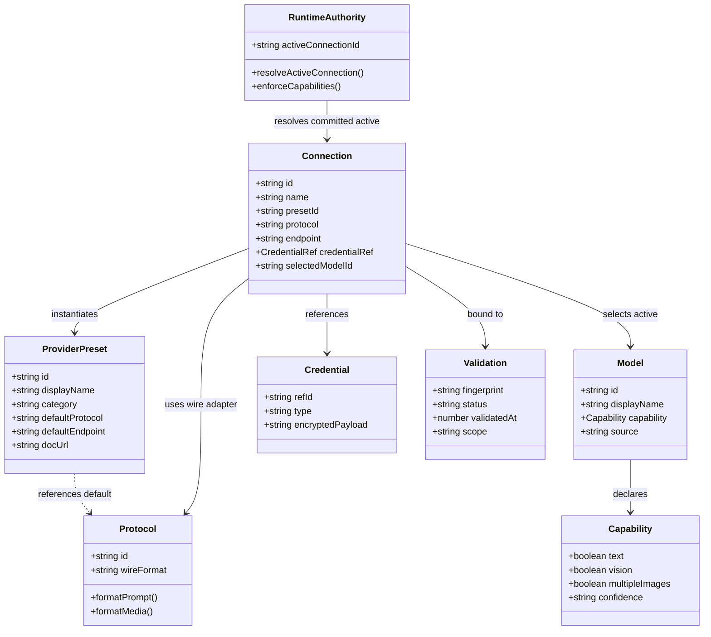

# UI-05R — Provider & Connection Architecture Specification V1

> **Document Status**: SUPERSEDED WITH E2B-2B AUTHORITY CLOSURE  
> **Repository**: `ljjnb666-nb/AI-Question-Analysis-Assistant-Browser-Extension`  
> **Associated PR**: #36 (`feat/ui-05-gemini-settings-first-run`)  
> **Base HEAD**: `1739db2c80842ac589537b35df3bde46324aa175`  
> **Frontend Owner**: Gemini Antigravity  
> **Gatekeeper**: ChatGPT  
> **Current Gate Status**: `UI_05_REVIEW_FIX_01 = CLOSED`, `E2B-2B AUTHORITY CLOSURE APPLIED`

> [!IMPORTANT]
> ### E2B-2B Authority Closure & Review Fix 01 Notice
> 1. **Single-Writer Authority**: The background control plane (`AIConnectionAuthority`, `AppSettingsAuthority`, `credentialStore`) is the sole authoritative writer of connection and credential state. Frontend settings UI surfaces are read-and-dispatch only.
> 2. **Zero Plaintext Key Fingerprints**: Any earlier mentions in this document or legacy code of computing fingerprints from raw or decrypted API keys are **DEPRECATED and SUPERSEDED**. Plaintext API keys must NEVER be hashed, fingerprinted, logged, or included in client receipts.
> 3. **Non-Secret Authority Revision Binding**: UI Ready status binds strictly to non-secret authority metadata: `connectionId`, `connectionRevision`, `credentialRevision`, and optional `validationGeneration`.
> 4. **Authoritative Invalidation**: Any authoritative change to `aiConnectionState` in storage immediately invalidates UI Ready.
> 5. **Fail-Closed Capability**: Provider catalog no longer declares static provider-level "Supports images / Text only" authority claims; unknown capabilities fail closed.

---

## 1. Executive Summary

The current Settings interface and AI provider configuration in Quiz Solver grew organically from an engineering diagnostic panel. It presents all ten supported providers in a flat "card wall," tightly couples provider brands to specific model series (e.g. `Anthropic (Claude)`, `OpenAI (GPT)`), mixes local runtimes (`Ollama`) and protocols (`Custom (OpenAI compatible)`) into the same conceptual tier as cloud SaaS companies, and models configuration as a single flat singleton inside `AppSettings`.

**UI-05R establishes a mature, commercial-grade AI Connection Architecture** inspired by leading open-source multi-model clients (Chatbox, Cherry Studio, Open WebUI, LobeChat) while strictly preserving Quiz Solver's runtime safety contracts:
1. **Separation of the Eight Core Concepts**: `ProviderPreset`, `Protocol`, `Connection`, `Model`, `Capability`, `Credential`, `Validation`, and `Runtime Authority`.
2. **Zero Runtime Conflation**: Protocols (`openai_chat_completions`, `anthropic_messages`) are cleanly separated from provider presets (DeepSeek, Zhipu, Moonshot, SiliconFlow), allowing shared wire adapters without UI distortion.
3. **Multi-Connection Ready**: Although V1 exposes an active singleton workflow, the underlying schema supports multi-connection topologies (e.g. Personal Claude vs Company Claude, multiple local Ollama instances) without breaking schema migrations.
4. **Decoupled Settings Information Architecture**: Replaces the intimidating card wall with a compact, elegant **Settings Home** (displaying the verified active connection), a searchable **Provider Catalog**, and an isolated **Connection Editor**.
5. **Fail-Closed Capability Model**: Unknown models or custom endpoints fail closed to text-only mode unless multi-modal vision capabilities are explicitly declared, probed, or overridden by the user, protecting Quiz Solver's visual question pipeline from unfillable parse failures.
6. **Strict Cryptographic Credential Isolation**: Preserves local AES-GCM (`qse:v1:...`) encrypted storage, ensuring API secrets never leak into general catalog representations or telemetry.

---

## 2. Current Architecture

An audit of the current codebase (`src/shared/ai/providers.ts`, `src/shared/ai/providerClients.ts`, `src/shared/utils/parseRouter.ts`, `src/shared/utils/storage.ts`, and `src/sidepanel/settingsPanel.tsx`) reveals the following architectural reality:

```
[UI Draft Form (settingsPanel.tsx)]
       │
       ├──> computeValidationFingerprint() ──> [Test Ping (parseQuestion)]
       │                                                 │
       └──> saveSettings()                               ▼
                 │                          [Wire Adapter Dispatcher]
                 ▼                          (providerClients.ts)
         [chrome.storage.local]             ├─ callAnthropic
           (flat AppSettings)               ├─ callOpenAICompat (x7 providers!)
                 │                          └─ callGemini
                 ▼
         [parseRouter.ts] ──> [Normal Solving Runtime]
```

### 2.1 Current Provider Registry (`src/shared/ai/providers.ts`)
- Defines a union of 10 literals: `ProviderId = "anthropic" | "openai" | "deepseek" | "gemini" | "qwen" | "moonshot" | "zhipu" | "minimax" | "ollama" | "custom"`.
- Each provider is statically configured via `ProviderConfig`:
  ```typescript
  export interface ProviderConfig {
    id: ProviderId;
    name: string;
    baseUrl: string;
    defaultModel: string;
    models: string[];
    supportsVision: boolean;
    supportsRemoteImageUrl: boolean;
    supportsInlineBase64: boolean;
    supportsMultipleImages: boolean;
    openaiCompat: boolean;
    authHeader: "bearer" | "x-api-key" | "none";
    keyPlaceholder: string;
    keyOptional?: boolean;
  }
  ```
- **Conflation**: Media capabilities (`supportsVision`, `supportsInlineBase64`, etc.) are declared at the **provider level**, even though vision capability is fundamentally a **model-level** property.

### 2.2 Current Client Wire Protocols (`src/shared/ai/providerClients.ts`)
- Despite having 10 distinct "providers", there are only **3 wire protocol implementations**:
  1. `callAnthropic`: Anthropic Messages API (`POST /v1/messages`), headers `x-api-key` or `Authorization: Bearer` (custom fallback retry), SSE stream parsing.
  2. `callOpenAICompat`: OpenAI Chat Completions API (`POST /v1/chat/completions`), Bearer token auth, SSE stream parsing. Shared by: `openai`, `deepseek`, `qwen`, `moonshot`, `zhipu`, `minimax`, `ollama`, and `custom` (when protocol is `openai`).
  3. `callGemini`: Google Generative Language API (`POST /v1beta/models/{model}:generateContent?key={apiKey}`).
- Minor provider-specific quirks are scattered ad-hoc inside `callOpenAICompat`:
  - `minimax`: Appends `thinking: { type: "adaptive" }`, `reasoning_split: true`, and switches `max_tokens` to `max_completion_tokens`.
- Ad-hoc capability overrides: `resolveEffectiveProviderMediaCapabilities()` patches media capabilities for custom endpoints that select the Anthropic protocol.

### 2.3 Current Runtime Authority & Storage (`src/shared/utils/storage.ts`)
- Storage maintains a flat singleton interface:
  ```typescript
  export interface AppSettings {
    providerId: string;
    apiKey: string;
    apiModel: string;
    preferredRoute: "auto" | "text" | "vision";
    language: "zh" | "en";
    enableAnalytics: boolean;
    analyticsConsentVersion: number;
    deviceId: string;
    analyticsBaseUrl: string;
    userId?: string;
    userEmail?: string;
    authToken?: string;
    customBaseUrl?: string;
    customProviderProtocol?: "openai" | "anthropic";
  }
  ```
- Sensitive credentials (`apiKey`, `authToken`) are encrypted with an AES-GCM envelope (`qse:v1:...`) on write and decrypted into memory on load.
- Normal runtime (`parseQuestion` in `src/shared/utils/parseRouter.ts`) reads directly from `settings.providerId`, `settings.apiKey`, `settings.apiModel`, `settings.customBaseUrl`.

---

## 3. Reference Project Findings

To design an enduring foundation, we audited four mature open-source multi-model client architectures: **Chatbox**, **Cherry Studio**, **Open WebUI**, and **LobeChat**.

```
┌─────────────────────────────────────────────────────────────────────────────────────────────┐
│                               ARCHITECTURAL MATRIX COMPARISON                               │
├─────────────────┬──────────────┬──────────────┬──────────────┬──────────────────────────────┤
│ Dimension       │ Chatbox      │ Cherry Studio│ Open WebUI   │ LobeChat                     │
├─────────────────┼──────────────┼──────────────┼──────────────┼──────────────────────────────┤
│ Provider Model  │ Preset Enum  │ Service Dict │ Pipe Adapter │ Modular Cards (@lobehub)     │
│ Connection      │ Flat/Preset  │ Multi-Service│ Multi-URL    │ Per-Provider Config Object   │
│ Model Catalog   │ Static+Fetch │ Dynamic Tree │ DB Model Reg │ Model Cards with Flags       │
│ Capabilities    │ Simple Tags  │ Granular Tag │ Pipe Flags   │ Vision, Tools, Reasoning     │
│ Custom Endpoint │ Custom Mode  │ Full Custom  │ Custom Pipes │ Generic OpenAI Proxy Engine  │
└─────────────────┴──────────────┴──────────────┴──────────────┴──────────────────────────────┘
```

### 3.1 Chatbox (`Bin-Huang/chatbox`)
- **PROVIDER_MODEL**: Enum of built-in presets (OpenAI, Azure, Claude, Ollama, Chatbox AI) + Custom Provider.
- **CONNECTION_MODEL**: Single active config per provider preset. Custom endpoints allow configuring base URL, auth token, and API path.
- **MODEL_MODEL**: Combines a static fallback list with an on-demand `/v1/models` discovery fetch. Allows freeform model name input.
- **CUSTOM_ENDPOINT_MODEL**: User specifies base URL, API key, and selects protocol compatibility (OpenAI vs Azure).
- **GOOD_IDEAS**:
  - Resilient model input: combo-box that allows picking discovered models or typing arbitrary model IDs.
  - Simple, direct connectivity test button with visual latency report.
- **IDEAS_NOT_SUITABLE_FOR_QUIZ_SOLVER**:
  - Lacks strict capability guarantees: assumes all models can accept images if the endpoint is reachable, which causes silent failures in image-heavy quiz questions.
  - Flat monolithic configuration without validation fencing.

### 3.2 Cherry Studio (`KangWenBin/Cherry-Studio`)
- **PROVIDER_MODEL**: Over 40 distinct provider presets organized into categories: Cloud Providers, Aggregators/Gateways, Local Runtimes, Custom Services.
- **CONNECTION_MODEL**: First-class "Service" entities. Each service has its own toggle state, base URL, API key, headers, and model manager.
- **MODEL_MODEL**: Highly granular model definitions. Each model possesses explicit capability tags: `vision`, `function_call`, `web_search`, `reasoning`. Models can be added, deleted, grouped, or dynamically fetched.
- **CUSTOM_ENDPOINT_MODEL**: Full support for custom OpenAI-compatible endpoints with custom request headers and URL path prefixes.
- **GOOD_IDEAS**:
  - Explicit model-level capability tagging (`vision: boolean`, `reasoning: boolean`).
  - Separation between "Preset Identity" and "Configured Instance".
  - Clean categorization in UI navigation.
- **IDEAS_NOT_SUITABLE_FOR_QUIZ_SOLVER**:
  - Heavy desktop-application complexity (assistants, system personas, vector databases, multi-agent chat). Quiz Solver is a focused browser extension solver that needs minimal friction and instant startup.

### 3.3 Open WebUI (`open-webui/open-webui`)
- **PROVIDER_MODEL**: Pipe/Adapter architecture (LiteLLM, direct OpenAI, Ollama instances).
- **CONNECTION_MODEL**: Centralized connection endpoint list. Supports multiple OpenAI-compatible base URLs and Ollama URLs with custom prefixes.
- **MODEL_MODEL**: Unified model registry where capabilities can be overridden per model.
- **CUSTOM_ENDPOINT_MODEL**: OpenAI-compatible endpoint registration with custom headers and route prefixes.
- **GOOD_IDEAS**:
  - Decoupling of provider routing from client UI.
  - Graceful fallback when model discovery fails.
- **IDEAS_NOT_SUITABLE_FOR_QUIZ_SOLVER**:
  - Server-client architecture with database persistence (PostgreSQL/SQLite) and multi-user RBAC. Quiz Solver runs client-side in a WebExtension environment using Chrome Storage.

### 3.4 LobeChat (`lobehub/lobe-chat`)
- **PROVIDER_MODEL**: Modular architecture with `@lobehub/icons` for visual branding and `@lobehub/model-runtime` for protocol execution. Providers are presets that declare default endpoints, supported capabilities, and model lists.
- **CONNECTION_MODEL**: Per-provider configuration card. Users can enable/disable providers, override base URLs, provide API keys, and test connectivity.
- **MODEL_MODEL**: Standardized "Model Card" schema: `id`, `displayName`, `tokens`, `vision: boolean`, `functionCall: boolean`, `reasoning: boolean`.
- **CUSTOM_ENDPOINT_MODEL**: Dedicated "Custom Provider" allowing arbitrary OpenAI-compatible proxies with custom headers.
- **GOOD_IDEAS**:
  - Polished visual design: brand icons, clean card layouts, separated connection editor.
  - Model Card schema cleanly abstracts capabilities away from provider branding.
  - Explicit distinction between official endpoints and custom proxies.
- **IDEAS_NOT_SUITABLE_FOR_QUIZ_SOLVER**:
  - Edge-runtime Next.js server architecture with cloud state synchronization.
  - Complex billing and token estimation overhead unnecessary for local browser parsing.

---

## 4. Current Modeling Problems

Based on the audit of Quiz Solver's code and reference projects, we identify the following concrete modeling problems:

```
┌────────────────────────────────────────────────────────────────────────────────────────────────┐
│                                CURRENT MODELING CONFLATIONS                                    │
├──────────────┬───────────────────────────────┬──────────┬──────────────────────────────────────┤
│ ID           │ Conflation                    │ Severity │ Concrete Manifestation in Code       │
├──────────────┼───────────────────────────────┼──────────┼──────────────────────────────────────┤
│ PROB-01      │ Brand vs Model Family         │ P1       │ "Anthropic (Claude)", "OpenAI (GPT)" │
│ PROB-02      │ Protocol treated as Provider  │ P0       │ "custom" is in ProviderId union      │
│ PROB-03      │ Local Runtime as Cloud Vendor │ P1       │ "ollama" in flat PROVIDERS array     │
│ PROB-04      │ Capability at Provider Level  │ P0       │ supportsVision boolean on provider   │
│ PROB-05      │ Single Global Connection Slot │ P1       │ AppSettings has 1 providerId/apiKey  │
│ PROB-06      │ Monolithic Settings UX        │ P1       │ Flat card wall of all 10 providers   │
│ PROB-07      │ Credential Coupling           │ P2       │ apiKey string assumes uniform auth   │
└──────────────┴───────────────────────────────┴──────────┴──────────────────────────────────────┘
```

### PROB-01: Provider Brand and Model Family Mixed (Severity: P1)
- **Problem**: UI names embed specific model family names: `Anthropic (Claude)`, `OpenAI (GPT)`, `Google Gemini`, `Moonshot Kimi`, `智谱 GLM`, `阿里云通义千问`.
- **Impact**: When Anthropic releases a non-Claude model or Google rebrands, the provider name becomes obsolete. Furthermore, users select a provider expecting a vendor, but are confused by redundant model branding.

### PROB-02: Protocol Represented as a Provider (Severity: P0)
- **Problem**: `custom` is modeled as a `ProviderId` alongside Anthropic and OpenAI. Inside `providers.ts`, it defaults to `openaiCompat: true`, but has an auxiliary `customProviderProtocol: "openai" | "anthropic"` setting.
- **Impact**: Violates domain modeling purity. An OpenAI-compatible gateway is a **protocol configuration**, not a service provider. It creates hacky patches like `resolveEffectiveProviderMediaCapabilities()` to emulate Anthropic behavior.

### PROB-03: Local Runtime Represented in the Same Layer as Cloud SaaS (Severity: P1)
- **Problem**: `ollama` is in the same flat `PROVIDER_IDS` array as OpenAI and Anthropic, differentiated only by `keyOptional: true` and `authHeader: "none"`.
- **Impact**: Ignores the distinct operational reality of local runtimes: local reachability issues, lack of auth keys, dynamic local model tags (`ollama list`), and local network security boundaries.

### PROB-04: Capability Declared at Provider Level Instead of Model Level (Severity: P0)
- **Problem**: `supportsVision: boolean` is declared on `ProviderConfig`. In `parseRouter.ts`, the runtime is forced to run regex heuristics (`isLikelyTextOnlyModel`) against the model name to override the provider's static declaration (e.g. `deepseek-v4` is text-only, while `qwen3-vl` is vision, but both sit under providers with static flags).
- **Impact**: If a user enters a custom vision model under an OpenAI-compatible endpoint, or an unknown model ID, the system either makes invalid assumptions or fails during visual question packaging.

### PROB-05: Singleton Configuration Slot (Severity: P1)
- **Problem**: `AppSettings` contains only one `providerId`, one `apiKey`, one `apiModel`, and one `customBaseUrl`.
- **Impact**: A user cannot keep their personal Claude key and their workplace Claude proxy configured simultaneously; switching requires overwriting endpoint, key, and model each time.

### PROB-06: Monolithic Settings Information Architecture (Severity: P1)
- **Problem**: The UI renders a massive card wall containing all 10 providers simultaneously, forcing the user to scroll past unused services, advanced route selectors, analytics toggles, and account auth.
- **Impact**: Overwhelming cognitive load, poor mobile/small sidepanel responsiveness, and violation of modern clean client design.

### PROB-07: Credential Tight-Coupling (Severity: P2)
- **Problem**: `apiKey: string` is the sole credential representation in `AppSettings`.
- **Impact**: Fails to accommodate query-string auth (Gemini uses `?key=...`), future Bearer tokens, or zero-auth local proxies without special-case branching.

---

## 5. The Eight Core Concepts

To eliminate these architectural defects, UI-05R strictly decouples the AI domain into **Eight Core Concepts**:



| Concept | Precise Definition | What it is NOT |
| :--- | :--- | :--- |
| **A. ProviderPreset** | A known vendor catalog definition containing metadata, documentation URLs, default endpoints, and suggested models. | Not a connection, not an API key, not a protocol adapter. |
| **B. Protocol** | A wire transmission adapter defining HTTP serialization, header structures, and streaming formats (e.g. OpenAI Chat, Anthropic Messages). | Not a provider brand. Multiple vendors share the same protocol. |
| **C. Connection** | A user-configured, persistent instance of an AI service with a defined endpoint, credential reference, and model choice. | Not a provider catalog; not a single global configuration slot. |
| **D. Model** | An AI model identifier with an associated capability profile and discovery source. | Not a provider display name; not a marketing brand. |
| **E. Capability** | Multidimensional capability profile (text, vision, reasoning) paired with a confidence source. | Not a static boolean flag attached to a provider vendor. |
| **F. Credential** | An abstracted secret reference managed via local AES-GCM encrypted storage. | Not a plaintext string visible in UI component state. |
| **G. Validation** | A cryptographically fenced proof of connectivity and capability bound to an immutable configuration fingerprint. | Not a transient UI test result; not runtime authority. |
| **H. Runtime Authority** | The committed, persisted active connection used by the quiz solving engine. | Never a draft form value; never an uncommitted test state. |

---

## 6. ProviderPreset

A `ProviderPreset` represents a known vendor or runtime template in the system catalog.

```typescript
export type ProviderPresetCategory =
  | "recommended"
  | "cloud"
  | "gateway"
  | "local"
  | "custom";

export interface ProviderPreset {
  id: string; // e.g. "anthropic", "deepseek", "alibaba"
  displayName: string; // e.g. "Anthropic", "DeepSeek", "阿里云百炼"
  category: ProviderPresetCategory;
  defaultProtocol: "anthropic_messages" | "openai_chat_completions" | "gemini_content";
  defaultEndpoint: string;
  documentationUrl: string;
  authHeader: "bearer" | "x-api-key" | "query_param" | "none";
  keyPlaceholder: string;
  keyOptional?: boolean;
  supportedModels: ModelDefinition[];
  modelDiscoveryStrategy: "static_only" | "openai_v1_models" | "ollama_tags";
  providerSpecificFields?: string[]; // e.g. ["azureDeployment", "apiVersion"]
  deprecationState?: {
    isDeprecated: boolean;
    migrationPresetId?: string;
    warningMessage?: string;
  };
}
```

---

## 7. Protocol

A `Protocol` defines wire transmission semantics independently of vendor branding:

```
┌─────────────────────────────────────────────────────────────────────────────┐
│                              PROTOCOL ADAPTERS                              │
├──────────────────────────┬────────────────────────────┬─────────────────────┤
│ Protocol Identifier      │ Wire Endpoint              │ Default Auth Header │
├──────────────────────────┼────────────────────────────┼─────────────────────┤
│ openai_chat_completions  │ /v1/chat/completions       │ Authorization: Bearer│
│ anthropic_messages       │ /v1/messages               │ x-api-key           │
│ gemini_content           │ /v1beta/models/{m}:generate│ ?key= query param   │
│ ollama_native (reserved) │ /api/chat                  │ None                │
└──────────────────────────┴────────────────────────────┴─────────────────────┘
```

### Shared Wire Adapters
- **`openai_chat_completions` Wire Adapter**: Shared by OpenAI, DeepSeek, 阿里云百炼 (Qwen), Moonshot AI, 智谱 AI, MiniMax, Ollama, OpenRouter, SiliconFlow, and Custom API (OpenAI mode).
- **`anthropic_messages` Wire Adapter**: Shared by Anthropic and Custom API (Anthropic mode).
- **`gemini_content` Wire Adapter**: Used by Google AI (Gemini).

---

## 8. Connection

A `Connection` is a user-configured instance of a provider preset or custom protocol:

```typescript
export interface Connection {
  id: string; // UUID, e.g. "conn_anthropic_main", "conn_local_ollama"
  name: string; // User-editable, e.g. "Anthropic (Work)", "DeepSeek Fast"
  presetId: string; // "anthropic", "deepseek", "custom", etc.
  protocol: "anthropic_messages" | "openai_chat_completions" | "gemini_content";
  endpoint: string; // Resolved base URL
  credentialRef: string; // Reference ID to encrypted secret store
  selectedModelId: string; // Currently active model ID for this connection
  customModels?: ModelDefinition[]; // User-added or discovered models
  providerSpecificConfig?: Record<string, string>; // Reserved for Azure/Vertex
  validation: {
    fingerprint: string | null;
    status: "never_tested" | "testing" | "validated" | "failed" | "stale";
    validatedAt?: number;
    errorCode?: string;
  };
  createdAt: number;
  updatedAt: number;
}
```

*Note on Multi-Connection*: V1 UI exposes a primary active connection workflow, but the storage engine stores connections in a normalized collection (`connections: Record<string, Connection>`) with an `activeConnectionId` pointer, permanently preventing schema lock-in.

---

## 9. Model

A `Model` represents a specific AI model callable through a connection:

```typescript
export type ModelDiscoverySource =
  | "built_in"           // Shipped statically with preset
  | "provider_discovered"// Fetched live via /v1/models
  | "cached_discovered"  // Persisted from previous live fetch
  | "manual";            // Entered manually by user

export interface ModelDefinition {
  id: string; // Exact API model ID, e.g. "claude-sonnet-4.6", "qwen3-vl-plus"
  displayName: string; // Human readable label
  capabilities: ModelCapabilities;
  source: ModelDiscoverySource;
  contextWindow?: number;
  deprecated?: boolean;
}
```

---

## 10. Capability

Capabilities are decoupled from provider branding and modeled multidimensionally:

```typescript
export type CapabilityConfidence =
  | "known_static"      // Hardcoded verified catalog metadata
  | "provider_reported" // Returned in model list metadata
  | "probed"            // Confirmed via real execution test
  | "user_override"     // Explicitly checked by user in settings
  | "unknown";          // Unverified; fails closed to text-only

export interface ModelCapabilities {
  text: boolean;
  vision: boolean;
  multipleImages: boolean;
  remoteImageUrl: boolean;
  inlineBase64: boolean;
  reasoning: boolean;
  structuredOutput: boolean;
  confidence: CapabilityConfidence;
}
```

### Fail-Closed Principle
If a model's vision capability is `unknown` (e.g. arbitrary model ID entered under a Custom API), **it fails closed to `vision: false`**. The user receives a clear explanation if they attempt to solve an image-based question, with an option to enable the "Force Multimodal Vision" toggle in the Connection Editor.

---

## 11. Credential

Secrets are abstracted via `CredentialRef` and isolated from React-visible metadata:

```typescript
export interface CredentialEntity {
  refId: string; // e.g. "cred_conn_123"
  type: "api_key" | "bearer_token" | "none";
  encryptedValue: string; // Encrypted with AES-GCM (qse:v1:...)
  updatedAt: number;
}
```

### Security Rules
1. Plaintext secrets are never stored in `Connection` metadata objects.
2. Connection metadata can be exported or logged to diagnostics without secret leaks.
3. Deleting a `Connection` automatically prunes its associated `CredentialEntity`.

---

## 12. Validation
 
> **DEPRECATION NOTICE (Review Fix 01 / E2B-2B)**:  
> Plaintext API-key fingerprinting (`Hash of endpoint + credential + model + protocol`) is **REMOVED and SUPERSEDED**.  
> In accordance with zero-leakage security boundaries, validation receipts bind exclusively to non-secret authority metadata (`connectionId`, `connectionRevision`, `credentialRevision`, and optional `validationGeneration`). The UI never extracts, hashes, or compares plaintext secrets.

Validation proves reachability and capability without corrupting runtime authority:

```typescript
export interface AuthorityValidationReceipt {
  connectionId: string;
  connectionRevision: number;
  credentialRevision?: number;
  validationGeneration?: number;
}
```

### Distinct Verification Scopes
- **Reachability**: The network endpoint responds to an HTTP OPTIONS/GET request.
- **Model Callable**: A minimal completion ping succeeds for the chosen model.
- **Vision Verified**: An image payload is accepted and processed by the model without error.

---

## 13. Runtime Authority

```
[User edits Connection Form]  ---> Modifies Draft React State (NO RUNTIME AUTHORITY)
             │
[Click "Test Connection"]     ---> Executes Validation Test on Draft (NO RUNTIME AUTHORITY)
             │
[Click "Save Connection"]     ---> Persists to chrome.storage.local
             │
[Set as Active Connection]   ---> Sets `activeConnectionId` in storage
                                            │
                                            ▼
                           [NORMAL SOLVING RUNTIME ENGINE]
                           (Only reads committed active connection!)
```

### Invariant
1. Draft form state in the Side Panel **never** influences background solving or active capture.
2. Successful validation of an uncommitted draft **never** marks the runtime Ready.
3. Normal solving runtime resolves strictly from:
   `activeConnectionId` $\rightarrow$ `committed Connection` $\rightarrow$ `Protocol Adapter` $\rightarrow$ `Decrypted Credential`.

---

## 14. Current Runtime Support Matrix

The following matrix documents the exact ground truth of the current repository (`src/shared/ai/providers.ts` and `src/shared/ai/providerClients.ts`):

```
┌───────────────────────────────────────────────────────────────────────────────────────────────────────────────────────────────────────────────────────┐
│                                                      CURRENT RUNTIME SUPPORT MATRIX                                                                    │
├──────────────┬──────────────────┬──────────────────────────┬──────────────┬────────────────────────────────────┬──────────────┬──────────────┬────────────┤
│ Provider ID  │ Runtime Support  │ Wire Protocol            │ Credential   │ Default Endpoint                   │ Vision Decl. │ Model Source │ Custom URL │
├──────────────┼──────────────────┼──────────────────────────┼──────────────┼────────────────────────────────────┼──────────────┼──────────────┼────────────┤
│ anthropic    │ Implemented      │ anthropic_messages       │ x-api-key    │ https://api.anthropic.com          │ Yes          │ Static list  │ Supported  │
│ openai       │ Implemented      │ openai_chat_completions  │ Bearer       │ https://api.openai.com             │ Yes          │ Static list  │ Supported  │
│ deepseek     │ Implemented      │ openai_chat_completions  │ Bearer       │ https://api.deepseek.com           │ No           │ Static list  │ Supported  │
│ gemini       │ Implemented      │ gemini_content           │ Query param  │ https://generativelanguage.google..│ Yes          │ Static list  │ Not wire-en│
│ qwen         │ Implemented      │ openai_chat_completions  │ Bearer       │ https://dashscope.aliyuncs.com/..  │ Yes          │ Static list  │ Supported  │
│ moonshot     │ Implemented      │ openai_chat_completions  │ Bearer       │ https://api.moonshot.cn            │ Yes          │ Static list  │ Supported  │
│ zhipu        │ Implemented      │ openai_chat_completions  │ Bearer       │ https://open.bigmodel.cn/api/paas  │ Yes          │ Static list  │ Supported  │
│ minimax      │ Implemented      │ openai_chat_completions  │ Bearer       │ https://api.minimaxi.com           │ Yes          │ Static list  │ Supported  │
│ ollama       │ Implemented      │ openai_chat_completions  │ None         │ http://localhost:11434             │ Yes          │ Static list  │ Supported  │
│ custom       │ Implemented      │ openai / anthropic split │ Bearer/x-key │ http://localhost:11434             │ Yes          │ Single entry │ Required   │
└──────────────┴──────────────────┴──────────────────────────┴──────────────┴────────────────────────────────────┴──────────────┴──────────────┴────────────┘
```

---

## 15. Provider Naming

We strip marketing model family names from provider brands.

```
┌──────────────────────────────┬──────────────────────────────┬──────────────────────────────┐
│ Legacy Visible Name          │ Proposed Clean Catalog Name  │ Classification               │
├──────────────────────────────┼──────────────────────────────┼──────────────────────────────┤
│ Anthropic (Claude)           │ Anthropic                    │ CURRENT_RUNTIME_SUPPORTED    │
│ OpenAI (GPT)                 │ OpenAI                       │ CURRENT_RUNTIME_SUPPORTED    │
│ Google Gemini                │ Google AI                    │ CURRENT_RUNTIME_SUPPORTED    │
│ DeepSeek                     │ DeepSeek                     │ CURRENT_RUNTIME_SUPPORTED    │
│ 阿里云通义千问               │ 阿里云百炼 (DashScope)        │ CURRENT_RUNTIME_SUPPORTED    │
│ Moonshot Kimi                │ Moonshot AI (月之暗面)        │ CURRENT_RUNTIME_SUPPORTED    │
│ 智谱 GLM                     │ 智谱 AI (Zhipu AI)           │ CURRENT_RUNTIME_SUPPORTED    │
│ MiniMax                      │ MiniMax                      │ CURRENT_RUNTIME_SUPPORTED    │
│ Ollama（本地）               │ Ollama                       │ CURRENT_RUNTIME_SUPPORTED    │
│ Custom（OpenAI 兼容）        │ 自定义 API (Custom API)      │ CURRENT_RUNTIME_SUPPORTED    │
├──────────────────────────────┼──────────────────────────────┼──────────────────────────────┤
│ OpenRouter                   │ OpenRouter                   │ CATALOG_DESIGN_CANDIDATE     │
│ SiliconFlow                  │ SiliconFlow (硅基流动)       │ CATALOG_DESIGN_CANDIDATE     │
│ 火山引擎方舟                 │ 火山引擎 (Volcengine Ark)    │ CATALOG_DESIGN_CANDIDATE     │
│ LM Studio                    │ LM Studio                    │ CATALOG_DESIGN_CANDIDATE     │
│ Azure OpenAI                 │ Azure OpenAI                 │ FUTURE_RUNTIME_CANDIDATE     │
│ Google Cloud Vertex AI       │ Vertex AI                    │ FUTURE_RUNTIME_CANDIDATE     │
└──────────────────────────────┴──────────────────────────────┴──────────────────────────────┘
```

---

## 16. Provider Catalog Taxonomy

The catalog organizes provider presets into intuitive functional groups:

```
┌─────────────────────────────────────────────────────────────────────────────┐
│                           CATALOG TAXONOMY                                  │
├───────────────────────────────┬─────────────────────────────────────────────┤
│ Category                      │ Included Presets                            │
├───────────────────────────────┼─────────────────────────────────────────────┤
│ 🌟 Recommended (推荐)         │ Anthropic, OpenAI, Google AI, DeepSeek      │
│ ☁️ Cloud Providers (主流云端)  │ 阿里云百炼, 智谱 AI, Moonshot AI, MiniMax   │
│ 🔀 Gateways (聚合网关)        │ OpenRouter, SiliconFlow                     │
│ 💻 Local Runtimes (本地模型)   │ Ollama, LM Studio                           │
│ ⚙️ Custom (自定义连接)        │ 自定义 API (Custom Endpoint)                │
└───────────────────────────────┴─────────────────────────────────────────────┘
```

---

## 17. Custom API Architecture

The legacy "Custom (OpenAI compatible)" provider is redesigned into an extensible **Custom API** connection template:

1. **Protocol Selector**:
   - `OpenAI Compatible` (`/v1/chat/completions`)
   - `Anthropic Compatible` (`/v1/messages`)
2. **Endpoint Specification**: Full base URL validation (must begin with `https://` or `http://localhost`).
3. **Authentication Type**:
   - `Bearer Token` (`Authorization: Bearer <key>`)
   - `Custom Header` (e.g. `x-api-key: <key>`)
   - `No Authentication`
4. **Capability Fencing**:
   - Defaults to text-only (`vision: false`).
   - Explicit user toggle: *"This custom endpoint supports OpenAI-standard image inputs"*.

---

## 18. Local Providers (Ollama & LM Studio)

Local runtimes have distinct operational characteristics:
- **Default Endpoints**: Ollama (`http://localhost:11434`), LM Studio (`http://localhost:1234`).
- **Zero Authentication**: Default to `authHeader: "none"`, but allow optional keys for local reverse proxies.
- **Reachability Diagnosis**: Provide specific localized network error messages if `fetch` fails:
  *"Local service unreachable. Please ensure Ollama/LM Studio is running and CORS is enabled (`OLLAMA_ORIGINS=*`)."*
- **Private Network Security**: Enforce that HTTP endpoints are strictly limited to `localhost` or `127.0.0.1`. Remote plain HTTP is blocked to prevent credential interception.

---

## 19. Model Discovery Architecture

To support future dynamic model discovery without destabilizing current operations:

```
┌─────────────────────────────────────────────────────────────────────────────┐
│                           MODEL DISCOVERY PIPELINE                          │
├─────────────────────────────────────────────────────────────────────────────┤
│ 1. Built-in Static Fallback Catalog (Always available offline)              │
│                           │                                                 │
│                           ▼ (User clicks "Refresh Models" or on first test) │
│ 2. Dynamic Fetch: GET {endpoint}/v1/models (or /api/tags for Ollama)       │
│                           │                                                 │
│             ┌─────────────┴─────────────┐                                   │
│             ▼                           ▼                                   │
│        [Success]                     [Error]                                │
│ Store in Cached Models         Log warning, keep existing cache,            │
│ & populate model picker        fall back to static models + freeform entry   │
└─────────────────────────────────────────────────────────────────────────────┘
```

- **Resilience Contract**: Discovery failure never blocks the user from typing a model name manually.

---

## 20. Validation Fence

Validation runs asynchronously and must be fenced against race conditions:

```
State Timeline:
T1: User edits API Key (Fingerprint FP_A)
T2: User clicks "Test Connection" (Spawns request with Generation=1, FP=FP_A)
T3: User quickly changes Model to "gpt-5.5" (Fingerprint FP_B)
T4: Response for Generation=1 returns HTTP 200 OK.
    Validation Guard Checks:
      FP_A === FP_B ? NO!
      Action: DISCARD RESULT. State remains UNVALIDATED / DIRTY.
```

- **Invariant**: A late response from an obsolete configuration fingerprint can **never** mark the active connection as Validated.

---

## 21. Credential Storage & Security

1. **Envelope Preservation**: Secrets remain encrypted inside `chrome.storage.local` using the current AES-GCM envelope (`qse:v1:...`).
2. **Memory Decryption Boundary**: Credentials are only decrypted into memory when the normal solver runtime initiates an authorized request.
3. **No Secret Bleed in UI**: Redact credentials in React state when rendering general lists or settings overviews.

---

## 22. Legacy Migration

To ensure seamless upgrades from legacy `AppSettings` without data loss:

```typescript
export function migrateLegacySettingsToConnections(legacy: AppSettings): {
  connections: Record<string, Connection>;
  activeConnectionId: string;
} {
  const legacyConnectionId = "conn_legacy_default";
  const presetId = legacy.providerId || "anthropic";
  const protocol =
    presetId === "anthropic" || (presetId === "custom" && legacy.customProviderProtocol === "anthropic")
      ? "anthropic_messages"
      : presetId === "gemini"
      ? "gemini_content"
      : "openai_chat_completions";

  const legacyConnection: Connection = {
    id: legacyConnectionId,
    name: "Default Connection",
    presetId,
    protocol,
    endpoint: legacy.customBaseUrl || getProvider(presetId).baseUrl,
    credentialRef: legacyConnectionId,
    selectedModelId: legacy.apiModel || getProvider(presetId).defaultModel,
    validation: {
      fingerprint: null,
      status: legacy.apiKey ? "stale" : "never_tested",
    },
    createdAt: Date.now(),
    updatedAt: Date.now(),
  };

  return {
    connections: { [legacyConnectionId]: legacyConnection },
    activeConnectionId: legacyConnectionId,
  };
}
```

- **Rollback Safety**: The migration writes the new `connections` structure alongside `appSettings`, allowing backward compatibility if an older build is loaded.

---

## 23. Settings Information Architecture

The Settings experience is restructured from a monolithic card wall into three focused views:

```
┌─────────────────────────────────────────────────────────────────────────────┐
│                            SETTINGS HOME (Default)                          │
├─────────────────────────────────────────────────────────────────────────────┤
│ ┌─────────────────────────────────────────────────────────────────────────┐ │
│ │ 🤖 ACTIVE AI SERVICE                                                    │ │
│ │                                                                         │ │
│ │  Anthropic                                          [ Test Connection ] │ │
│ │  Model: claude-sonnet-4.6                           [ Change Service  ] │ │
│ │  ● Status: Verified & Ready                                             │ │
│ └─────────────────────────────────────────────────────────────────────────┘ │
│                                                                             │
│ ⚙️ GENERAL SETTINGS                                                         │
│   Language: [ 中文 (简体) ▾ ]                                              │
│   Solving Route: [ 自动识别 (Auto) ▾ ]                                     │
│                                                                             │
│ 👤 ACCOUNT & CLOUD                                                          │
│   Signed in as: user@example.com (Pro Tier)            [ Manage Account ] │ │
│                                                                             │
│ 🔒 PRIVACY & ANALYTICS                                                      │
│   Telemetry & Performance Diagnostics: [ Toggle ON ]                        │
└─────────────────────────────────────────────────────────────────────────────┘
                                  │
                                  ▼ Click [ Change Service ]
┌─────────────────────────────────────────────────────────────────────────────┐
│                          MANAGE AI SERVICES (Catalog)                       │
├─────────────────────────────────────────────────────────────────────────────┤
│ 🔍 [ Search providers or models...                                      ]   │
│                                                                             │
│ [ All ]  [ 🌟 Recommended ]  [ ☁️ Cloud ]  [ 💻 Local ]  [ ⚙️ Custom ]        │
│                                                                             │
│ ┌──────────────────────┐ ┌──────────────────────┐ ┌──────────────────────┐  │
│ │ Anthropic            │ │ OpenAI               │ │ DeepSeek             │  │
│ │ Claude 3.5 / 4.6     │ │ GPT-4o / GPT-5       │ │ V3 / R1 Flash        │  │
│ │ [ Configure ]        │ │ [ Configure ]        │ │ [ Configure ]        │  │
│ └──────────────────────┘ └──────────────────────┘ └──────────────────────┘  │
└─────────────────────────────────────────────────────────────────────────────┘
                                  │
                                  ▼ Click [ Configure ]
┌─────────────────────────────────────────────────────────────────────────────┐
│                           CONNECTION EDITOR (Modal / Subpage)               │
├─────────────────────────────────────────────────────────────────────────────┤
│ Service: Anthropic                                                          │
│ Connection Name: [ Anthropic Official                             ]         │
│ API Key:         [ sk-ant-api03-••••••••••••••••••••••••••••••••• ]         │
│ Model:           [ claude-sonnet-4.6 ▾ ]   [ 🔄 Refresh Models ]            │
│ Endpoint:        [ https://api.anthropic.com (Default)            ]         │
│                                                                             │
│ [ ⚡ Test Connection ]                       [ Cancel ]  [ Save & Activate ]│
└─────────────────────────────────────────────────────────────────────────────┘
```

---

## 24. First-Run UX Flow

For new users with no configured AI service:

```
[User installs extension / opens Side Panel]
                   │
                   ▼
    Has valid active connection?
        ├── YES ──> Open Normal Solver Workspace
        └── NO  ──> Display First-Run Welcome Card:
                       │
                       ▼
          [ "Set Up Your AI Service" ]
          "Quiz Solver requires an AI model to analyze questions."
                       │
                       ▼
          Display Curated Quick-Start Picks:
          [ Anthropic ]  [ OpenAI ]  [ DeepSeek ]  [ Ollama ]
                       │
                       ▼
          User enters API Key & selects model
                       │
                       ▼
          User clicks [ Save & Test ]
                       │
                       ▼
          Verification passes ──> Return to Solver Workspace immediately!
```

- **Elimination of Sticky Stepper**: The 4-step onboarding bar is shown **only** during first run and permanently dismissed once the first connection is verified.

---

## 25. Returning User UX Flow

- Returning users see the compact **Settings Home**.
- Quick model switching (e.g. between `claude-sonnet-4.6` and `claude-opus-4.8`) is accessible directly from Settings Home without re-entering the full configuration flow.
- A single click on **"Test Connection"** verifies latency and operational readiness on demand.

---

## 26. Security Boundaries

| Scope | Security Rule | Enforcement Level |
| :--- | :--- | :--- |
| **Host Permissions** | Custom endpoints must adhere to WebExtension CSP and declared host permissions. | Chrome Runtime Manifest |
| **Localhost Access** | Local HTTP connections (`http://localhost:*`, `http://127.0.0.1:*`) are permitted for local runtimes; remote plain HTTP is blocked. | Pre-flight URL validator |
| **Secret Redaction** | API keys are masked (`sk-ant-...••••`) in UI inputs and scrubbed from crash reports and telemetry. | Storage and Logger filter |
| **Account Authority** | A Quiz Solver user account (JWT) never grants access to third-party AI APIs; AI keys never authenticate Quiz Solver accounts. | Domain isolation |

---

## 27. V1 Scope (`MUST_IMPLEMENT_IN_UI05R`)

1. **Refined Conceptual Boundaries**: Strict separation of Provider Preset, Protocol, Connection, and Model.
2. **Corrected Provider Names**: Strip model families from provider names (Anthropic, OpenAI, Google AI, DeepSeek, etc.).
3. **Settings Information Architecture**:
   - Compact **Settings Home** with active connection card.
   - Categorized **Provider Catalog** with search and filters.
   - Dedicated **Connection Editor** with isolated draft state.
4. **Validation Fencing**: Strict fingerprint binding preventing stale test results from corrupting connection status.
5. **Fail-Closed Vision Handling**: Model-level capability check in `parseRouter` preventing image parsing crashes.
6. **Backward-Compatible Storage Migration**: Seamless migration of existing `AppSettings` to `Connection` schema.

---

## 28. Deferred Scope (`ARCHITECTURE_RESERVED_NOT_IMPLEMENTED`)

1. **Multi-Connection UI**: Concurrent management of multiple accounts for the same provider (schema ready, UI deferred to V2).
2. **Live Dynamic Model Discovery**: Querying `/v1/models` over the wire (architecture designed, implementation deferred).
3. **Deep Multimodal Capability Probing**: Active verification of image resolution limits via test ping.
4. **OAuth 2.0 / Google Service Accounts**: Enterprise auth flows.

---

## 29. Required Runtime Changes

1. **`src/shared/types/settings.ts`**: Introduce `Connection`, `ModelDefinition`, `ModelCapabilities`, and `ValidationRecord` schemas.
2. **`src/shared/utils/storage.ts`**: Implement `migrateLegacySettingsToConnections()` and update storage hooks to persist normalized connections.
3. **`src/shared/utils/parseRouter.ts`**: Update `parseQuestionCore` to resolve the active connection and inspect model-level capabilities rather than provider-level flags.

---

## 30. Required Frontend Changes

1. **`src/sidepanel/settingsPanel.tsx`**: Replace the monolithic single-panel component with a 3-view state machine (`home`, `catalog`, `editor`).
2. **`src/sidepanel/settingsSections.tsx`**: Replace the provider card wall with the compact active connection card and clean catalog grid.
3. **`src/sidepanel/settingsTypes.ts`**: Bind validation fingerprints to the normalized `Connection` schema.

---

## 31. Migration Risks & Mitigations

| Risk | Likelihood | Mitigation Strategy |
| :--- | :--- | :--- |
| **User Key Loss** | Low | Encryption keys and AES-GCM envelopes remain identical; migration only copies strings into the new connection record. |
| **Legacy Addon Desync** | Low | `AppSettings` singleton is maintained as a synthesized projection during V1 so older components continue to function. |
| **Custom Endpoint Format Incompatibility** | Medium | Endpoint normalizer handles trailing slashes, `/v1` duplication, and protocol prefixes. |

---

## 32. Open Questions

1. *Should dynamic model discovery be triggered automatically when entering an API key, or only on explicit user click?*  
   **Recommendation**: Explicit user click on a "Refresh Models" button to prevent unexpected network requests or rate limits.
2. *Should Custom API allow custom HTTP headers (e.g. `X-Custom-Auth`) in V1?*  
   **Recommendation**: Reserve in schema, defer UI exposure to V2 unless requested by users.

---

## 33. Recommended Implementation Order

1. **Phase 1 (Engineering / Codex)**:
   - Implement domain types in `src/shared/types/connection.ts`.
   - Implement storage migration in `src/shared/utils/storage.ts` with comprehensive unit tests.
   - Update `parseRouter.ts` to consume resolved active connection models.
2. **Phase 2 (Frontend / Gemini)**:
   - Build Settings Home with active connection card.
   - Build Provider Catalog with search and categorization.
   - Build Connection Editor with Save & Test validation fencing.
   - Update first-run welcome flow.
3. **Phase 3 (Review Gate / ChatGPT)**:
   - Verify validation authority invariants.
   - Verify credential encryption preservation.
   - E2E Playwright validation of first-run and returning user flows.

---

## 34. Decision Table

| CONCERN | CURRENT OWNER | PROPOSED OWNER | CHANGE REQUIRED | UI05R NOW? | NOTES |
| :--- | :--- | :--- | :--- | :--- | :--- |
| **Provider Identity** | `providers.ts` (`ProviderConfig`) | `ProviderPreset` registry | Clean naming, decouple models | YES | Strip model families from names |
| **Protocol Adapter** | Ad-hoc in `providerClients.ts` | Protocol Registry (`openai_chat_completions`, etc.) | Formalize protocol wire handlers | YES (Types) / NO (Clients) | Keep existing wire clients in V1 |
| **Endpoint URL** | `AppSettings.customBaseUrl` | `Connection.endpoint` | Moved to connection entity | YES | Normalizes base URL |
| **Credential** | `AppSettings.apiKey` | `CredentialRef` + Encrypted Store | Preserves AES-GCM envelope | YES | Keeps secrets out of UI metadata |
| **Model Selection** | `AppSettings.apiModel` | `Connection.selectedModelId` | Moved to connection entity | YES | Bound to connection |
| **Capability** | `ProviderConfig.supportsVision` | `ModelCapabilities` on Model | Model-level capability check | YES | Fails closed on unknown models |
| **Validation Authority** | `settingsPanel.tsx` fingerprint | `ValidationRecord` tied to Connection | Strict fingerprint invalidation | YES | Carried over from RF01 fix |
| **Draft Form State** | `settingsPanel.tsx` React state | `ConnectionEditor` local state | Isolated from runtime | YES | Edits never affect active solver |
| **Saved Config** | `chrome.storage.local` (`appSettings`) | `chrome.storage.local` (`connections`) | Storage schema migration | YES | Backward compatible shim |
| **Active Config** | Implicit singleton | Explicit `activeConnectionId` | Dedicated pointer | YES | Decouples multiple connections |
| **Model Discovery** | Static array in `providers.ts` | Model Discovery Pipeline | Architecture contract | RESERVED | Static fallback in V1 |
| **Multi-Connection** | Not supported | Schema-supported, UI singleton | Schema ready | RESERVED | Multi-conn UI in future phase |
| **Auth Account** | `useAuthController.ts` | `useAuthController.ts` | Clear visual separation | YES | Distinct section on Settings Home |
| **Telemetry Analytics** | `storage.ts` & `analytics.ts` | General Settings section | Separated from AI connection | YES | Grouped under Privacy section |
| **Parse Route** | `AppSettings.preferredRoute` | General Settings / Active Connection | Clean UI picker | YES | Auto / Text / Vision |

---

## 35. Implementation Plan by Owner

### CODEX / ENGINEERING
1. Create `src/shared/types/connection.ts` defining `ProviderPreset`, `Connection`, `ModelDefinition`, and `ModelCapabilities`.
2. Implement schema migration in `src/shared/utils/storage.ts` converting legacy `AppSettings` to `Connection` records.
3. Update `src/shared/utils/parseRouter.ts` to resolve runtime parameters from the active connection.

### GEMINI / FRONTEND
1. Implement **Settings Home** with active service status card, latency test, and navigation buttons.
2. Implement **Provider Catalog** with category tabs (Recommended, Cloud, Gateways, Local, Custom) and search filter.
3. Implement **Connection Editor** supporting credential entry, model selection, custom endpoint override, and validation fencing.
4. Redesign **First-Run Experience** to guide new users directly through quick connection setup without the sticky stepper.

### CHATGPT GATE
1. Review schema migration tests and verify zero data loss for existing users.
2. Verify validation authority invariants: uncommitted drafts or late async tests must never mark runtime ready.
3. Audit security boundaries: host permissions, localhost isolation, and credential encryption.
4. Perform final visual and functional gate review before merging PR #36.
